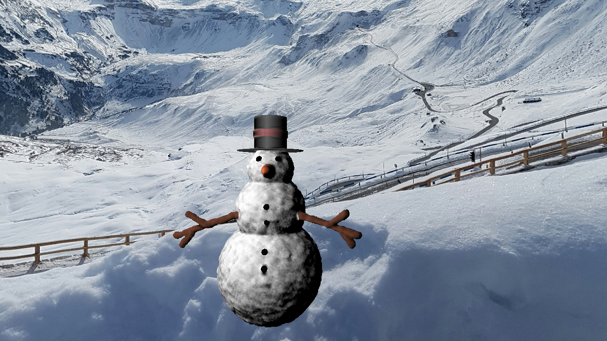

# Snowman

Master 1 Computer Science project aimed at creating a snowman in c++ starting from scratch using raymarching.

The constraints are:
-   The snowman must be created using only the standard library
-   The rendering time must be less than 1 hour

The snowballs making up the structure of the snowman use Brownian motion to create a more natural look.

We also used the smooth-union function to create a smooth transition between the snowballs and other shapes.

## Authors

-   **Claire Kurth** - [clairekth](https://github.com/clairekth)
-   **Victor Dallé** - [victord54](https:://github.com/victord54)
-   
### Credits

-   [Inigo Quilez](https://www.iquilezles.org/www/articles/distfunctions/distfunctions.htm) for the smooth-union function and the distance functions
-   Daniel Shiffman for the Brownian motion algorithm
-   [Dmitry Sokolov](https://github.com/ssloy/tinykaboom.git) for the bootstrap code

## Getting Started

### Prerequisites

-   C++ compiler
-   CMake
-   Make

### Installing and running

```bash
git clone https://github.com/clairekth/Snowman.git
cd Snowman
mkdir build && cd build
cmake ..
make && ./snowman
```

## Result



1280x720 resolution rendered in 48.5 seconds on a 3.6GHz Intel Core i7-9700K CPU